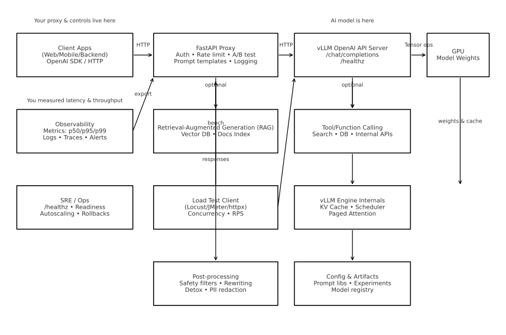

## LLM Serving Architecture (vLLM + FastAPI Proxy)

**Akış:** İstemci → FastAPI Proxy → vLLM (OpenAI uyumlu) → GPU'daki LLM  
**Proxy’de yönetilenler:** Kimlik doğrulama, rate limit, A/B test, prompt şablonları, log/metric.  
**Ops:** `/healthz`, gözlemlenebilirlik (p50/p95/p99), alarmlar.  
**Opsiyonel:** RAG (vektör DB), tool/function calling.  
**Test:** Basit yük testiyle gecikme ve throughput ölçümü.
